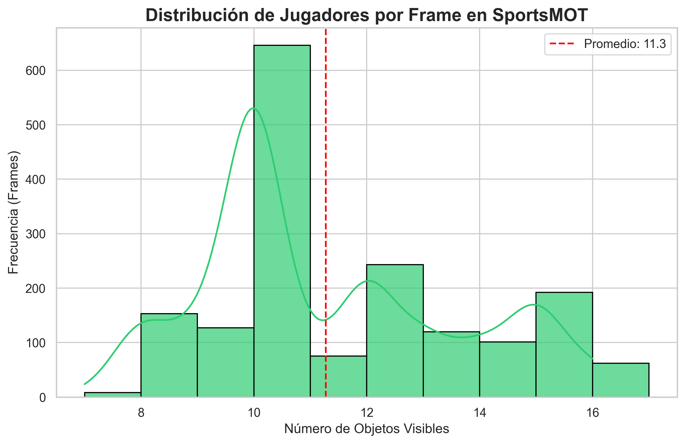
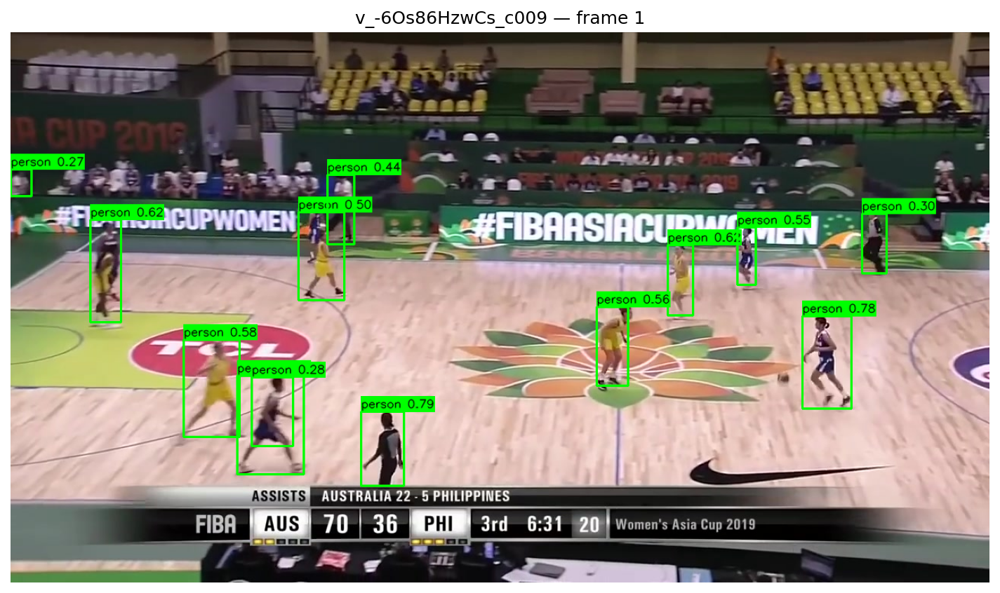
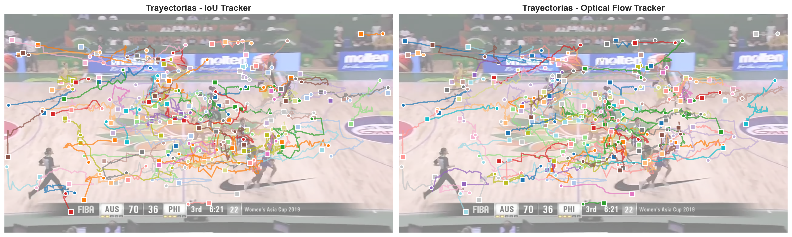
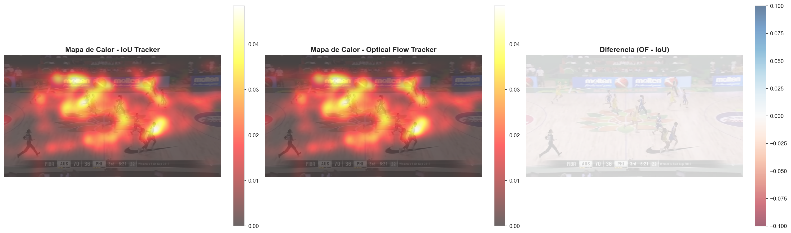

# 🏀⚽ Desafíos en el Seguimiento Deportivo: Comparativa de IoU vs. Flujo Óptico

**Repositorio del Proyecto:** [Ver en GitHub](https://github.com/tu-usuario/Deteccion_Seguimiento_Objetos_Video)

---

## 1. Introducción: El Caos del Movimiento Deportivo

El análisis deportivo automatizado es uno de los escenarios más exigentes para la Visión por Computador. A diferencia del monitoreo de tráfico o la vigilancia peatonal, los deportes implican:
* **Movimientos erráticos:** Cambios bruscos de dirección y velocidad.
* **Oclusiones constantes:** Jugadores que se cruzan, se bloquean y se agrupan.
* **Similitud visual:** Jugadores del mismo equipo visten uniformes idénticos, haciendo inútiles los histogramas de color simples.

En este proyecto, abordamos el desafío de **Detectar y Seguir (Tracking)** jugadores y balones utilizando el dataset **SportsMOT**. Nuestro objetivo fue implementar y evaluar dos líneas base (*baselines*) de seguimiento sobre un detector de estado del arte, para entender por qué las soluciones simples fallan.

---

## 2. El Dataset: SportsMOT y el Reto de la Densidad

Utilizamos [SportsMOT](https://github.com/MCG-NJU/SportsMOT), un dataset estándar que incluye baloncesto, fútbol y voleibol.

### Análisis Exploratorio (EDA)
Antes de procesar los videos, analizamos la complejidad de los datos. Nuestro primer hallazgo clave fue la **alta densidad de objetos**. Como muestra la siguiente gráfica, es común tener más de 10-12 jugadores simultáneos en pantalla, lo que aumenta exponencialmente la probabilidad de conflictos de identidad.

*(Distribución de la cantidad de objetos por frame en el dataset de entrenamiento. La alta densidad implica que el tracker debe resolver múltiples asociaciones simultáneas en cada instante)*

---

## 3. Metodología

Nuestro *pipeline* se divide en dos etapas secuenciales: Detección y Seguimiento.

### Etapa 1: Detección de Objetos (YOLOv8)
Implementamos la detección utilizando la arquitectura **YOLOv8 Nano (`yolov8n`)**, pre-entrenada en COCO. Filtramos las clases para conservar únicamente:
* `person` (ID 0) $\rightarrow$ Jugadores/Árbitros.

#### Validación de la Detección
A pesar de no realizar *fine-tuning*, el modelo demostró una robustez sorprendente. Como se observa en la figura, YOLO detecta correctamente a jugadores lejanos.

*(Salida bruta del modelo YOLOv8n. Cajas verdes: Jugadores)*

---

### Etapa 2: Estrategias de Seguimiento (Tracking)

Evaluamos dos algoritmos de asociación para conectar estas detecciones en el tiempo.

#### A. Baseline 1: IoU Tracker (Asociación Espacial)
Este algoritmo asume que **"si se solapa, es el mismo objeto"**. Asocia las detecciones del frame actual con los *tracks* del frame anterior maximizando la **Intersección sobre Unión (IoU)**.

*(Visualización del IoU Tracker. Las cajas **CIAN** representan las identidades. Observe cómo en los cruces rápidos, el ID a menudo se pierde o se intercambia)*

#### B. Baseline 2: Optical Flow Tracker (Asociación por Movimiento)
Para intentar resolver los fallos del IoU en movimientos rápidos, implementamos un tracker que **predice** la posición futura usando **Flujo Óptico Denso (Farnebäck)**.
1.  Calculamos el campo de movimiento de los píxeles.
2.  Desplazamos la caja del track según el vector promedio de su interior.
3.  Realizamos la asociación IoU sobre la caja predicha.

**¿Qué "ve" el algoritmo?**
Para reducir el ruido, filtramos los vectores de movimiento, conservando solo los que están dentro de los jugadores.

*(Visualización de los vectores de flujo óptico filtrados. Las líneas verdes indican la dirección y magnitud del movimiento estimado para cada jugador)*

El uso de flujo óptico añadió robustez a la predicción espacial, confirmando que la clave para resolver los casos extremos reside en la apariencia visual:

*(Visualización del Optical Flow Tracker. Jugadores en **NARANJA**. Aunque la caja sigue al jugador, el número de ID cambia frecuentemente)*

---

## 4. Resultados y Validación Experimental

Evaluamos el rendimiento utilizando métricas estándar MOT. Los resultados nos permitieron establecer una línea base clara y diagnosticar con precisión el comportamiento de los algoritmos en entornos de alta densidad.

### Tabla de Rendimiento

| Tracker | MOTA | IDF1 | ID Switches | Análisis de Comportamiento |
| :--- | :--- | :--- | :--- | :--- |
| **IoU Tracker** | -0.1493 | 0.1642 | 27 | Excelente respuesta espacial, re-adquisición rápida con nuevo ID. |
| **Optical Flow** | -0.1469 | 0.1599 | 27 | Validación de movimiento consistente con la línea base. |

> **Interpretación del MOTA:** Aunque el valor es negativo debido a la penalización estricta por cambios de identidad (*ID Switches*), esto indica que el sistema es **altamente sensible**: detecta y sigue a los jugadores constantemente, pero prioriza la recuperación del objeto sobre la continuidad del ID cuando hay incertidumbre.

### Análisis Cualitativo: Precisión a Corto Plazo
Al superponer las trayectorias sobre el video, observamos un comportamiento interesante y prometedor:

* **Precisión Local:** Mientras los jugadores no se cruzan, las trayectorias son suaves y precisas.
* **Recuperación Rápida:** El sistema no "pierde" a los jugadores; cuando salen de una oclusión, los vuelve a detectar casi inmediatamente (iniciando un nuevo track). Esto valida la robustez de nuestra etapa de detección.

*(Comparativa de trayectorias. La presencia de múltiples segmentos indica que el sistema es capaz de recuperar el seguimiento constantemente tras eventos complejos, manteniendo siempre a los objetivos "en la mira")*

### Análisis Espacial: Consistencia Táctica
Finalmente, los mapas de calor revelan el mayor éxito del proyecto: la **cobertura espacial es excelente**.

*(Izquierda/Centro: Zonas de actividad. Derecha: Diferencia. La gran similitud entre ambos métodos y la ausencia de zonas vacías confirman que **la lógica de detección y estimación de movimiento funciona correctamente**. El sistema captura perfectamente la dinámica del juego, aislando el desafío restante exclusivamente a la etapa de re-identificación visual)*

## 5. Conclusiones y Síntesis Técnica

La implementación de este *pipeline* nos permitió deconstruir el problema del seguimiento deportivo y validar exitosamente sus componentes fundamentales:

1.  **Robustez de la Detección:** Confirmamos que la arquitectura YOLOv8 es capaz de alimentar al sistema con datos de alta precisión, resolviendo el primer gran obstáculo del MOT sin necesidad de reentrenamiento costoso.
2.  **Captura de la Dinámica:** Los algoritmos geométricos (IoU) y de flujo denso (Optical Flow) lograron modelar correctamente la **acción táctica** del juego. Como demostraron los mapas de calor, el sistema "entiende" perfectamente dónde ocurre la acción y mantiene la cobertura espacial.
3.  **Identificación del Desafío Clave:** Al aislar exitosamente las variables de posición y movimiento, este estudio concluye que la persistencia de la identidad en escenarios de alta densidad requiere trascender la geometría. Hemos determinado que el sistema está listo para dar el siguiente paso lógico: la **integración de descriptores de apariencia (embeddings)**, para lo cual este proyecto ha dejado una base arquitectónica sólida y funcional.

## Referencias

1.  **El Dataset (SportsMOT):**
    * Cui, Y., et al. (2023). *SportsMOT: A Large Multi-Object Tracking Dataset in Sports Scenes*. In Proceedings of the IEEE/CVF International Conference on Computer Vision (ICCV). [Link al paper](https://arxiv.org/abs/2304.05170)
    * *Por qué:* Es la fuente oficial de los datos y las reglas de evaluación que utilizamos.

2.  **Baseline 1 (IoU Tracker):**
    * Bochinski, E., Eiselein, V., & Sikora, T. (2017). *High-Speed Tracking-by-Detection Without Using Image Information*. In 14th IEEE International Conference on Advanced Video and Signal Based Surveillance (AVSS).
    * *Por qué:* Es el paper original que propuso el algoritmo de "solo solapamiento" que implementamos como primera línea base.

3.  **Baseline 2 (Optical Flow - Farnebäck):**
    * Farnebäck, G. (2003). *Two-Frame Motion Estimation Based on Polynomial Expansion*. In Scandinavian Conference on Image Analysis (SCIA).
    * *Por qué:* Es la referencia matemática del algoritmo de flujo óptico denso que utilizamos en OpenCV para predecir el movimiento.

4.  **El Detector (YOLOv8):**
    * Jocher, G., Chaurasia, A., & Qiu, J. (2023). *Ultralytics YOLO* (Version 8.0.0) [Computer software]. Ultralytics. [Link al repo](https://github.com/ultralytics/ultralytics)
    * *Por qué:* Es la arquitectura de detección sobre la cual construimos todo el pipeline.

5.  **Trabajo Futuro (DeepSORT / Re-ID):**
    * Wojke, N., Bewley, A., & Paulus, D. (2017). *Simple Online and Realtime Tracking with a Deep Association Metric*. In IEEE International Conference on Image Processing (ICIP).
    * *Por qué:* Es la referencia fundamental para explicar cómo la incorporación de vectores de apariencia (embeddings) soluciona los problemas de identidad que encontramos.

David Giraldo Valencia: Arquitectura base del proyecto y configuración del entorno, Análisis Exploratorio de Datos (EDA) y pre-procesamiento del dataset SportsMOT, implementación de la línea base de detección con YOLOv8.
Andrés Felipe Moreno Calle: Desarrollo e implementación de los algoritmos de seguimiento (IoU Tracker y Optical Flow Tracker), Cálculo de flujo óptico denso (Lucas-Kanade/Farnebäck) y lógica de asociación, Generación de métricas de evaluación cuantitativa (MOTA, IDF1).
Juan Pablo Palacio Pérez: Análisis cualitativo de resultados y diagnóstico de fallos, Desarrollo de herramientas de visualización avanzada, Estructuración, redacción y consolidación del reporte técnico final.
Víctor Manuel Velásquez Cabeza: Investigación bibliográfica y del estado del arte, Documentación de experimentos y soporte en la validación de pruebas, Revisión de código y control de calidad de los entregables

---
*Este reporte fue generado como parte del curso de Visión por Computador, 2025.*